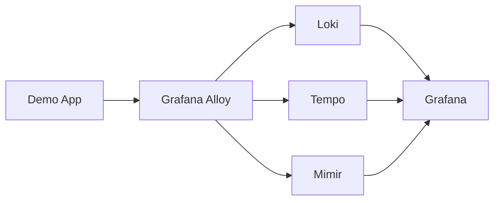

# Observability Platform — LGTM + CNCF

This repository contains a **production‑grade observability platform** built using the **App‑of‑Apps pattern with Argo CD**. It integrates the **LGTM stack (Loki, Grafana, Tempo, Mimir)** with modern CNCF components, hardened for scale, reliability, and resume storytelling.

Designed for **multi-cluster Kubernetes environments**, this repo demonstrates platform engineering best practices in **Monitoring, Observability, GitOps, and SRE**.

`https://img.shields.io/badge/CI-passing-brightgreen`  
`https://img.shields.io/badge/Terraform-v1.8+-blue`  
`https://img.shields.io/badge/Helm-v3.12+-blue`  
`https://img.shields.io/badge/GitOps-ArgoCD-orange`  

---

## 📖 Repository Description

The `observability-platform` repo demonstrates **platform engineering maturity**:
- **GitOps orchestration**: Argo CD App‑of‑Apps pattern manages infra + apps.
- **Observability stack**: Unified pipelines for metrics, logs, and traces.
- **SLOs as Code**: Availability and latency objectives defined via Sloth/Pyrra.
- **Production hardening**: Resource limits, persistence, PodDisruptionBudgets, NetworkPolicies.
- **Resume differentiation**: Modern CNCF adoption (Mimir, Tempo, Alloy) beyond vanilla Prometheus.

This repo is designed to look like a **platform team deliverable**, not a tutorial — complete with ADRs, runbooks, architecture docs, and interview prep notes.

---

## 📂 Repository Structure

observability-platform/
├── infra/
│   ├── terraform/
│   │   ├── main.tf                # K3D cluster + ArgoCD bootstrap
│   │   ├── variables.tf
│   │   └── outputs.tf
│   └── k3d/
│       └── cluster.yaml           # 1 server + 2 agents
│
├── apps/
│   ├── demo-app/
│   │   ├── src/                   # Demo app code with OTel SDKs
│   │   └── kustomize/             # Deployment manifests
│   └── slo/
│       ├── sloth.yaml             # 99.9% availability SLO
│       └── pyrra.yaml             # 95% latency SLO
│
├── observability/
│   ├── grafana/
│   │   └── kustomize/
│   ├── mimir/
│   │   └── kustomize/
│   ├── loki/
│   │   └── kustomize/
│   ├── tempo/
│   │   └── kustomize/
│   ├── alloy/
│   │   └── kustomize/
│   └── alerting/
│       ├── alertmanager.yaml
│       └── runbooks/
│           ├── availability.md
│           └── latency.md
│
├── argo-apps/
│   ├── root-app.yaml              # App-of-Apps root
│   ├── grafana-app.yaml
│   ├── mimir-app.yaml
│   ├── loki-app.yaml
│   ├── tempo-app.yaml
│   ├── alloy-app.yaml
│   └── demo-app.yaml
│
├── docs/
│   ├── architecture.md           # High-level flow + mermaid diagram + screenshots
│   ├── interview-prep.md         # Crisp answers to common SRE/DevOps questions
│   ├── adr/
│   │   └── 001-why-mimir-over-prometheus.md
│   └── runbooks/
│       ├── availability.md       # Runbook for availability SLO breach
│       └── latency.md            # Runbook for latency SLO breach
│
└── README.md

```

---

## 🛠 Prerequisites
- Windows 11  
- Docker Desktop  
- K3D (multi-node: 1 server + 2 agents)  
- kubectl  
- Helm v3.12+  
- Terraform v1.8+  

---

## 🚀 Quick Start

1. **Bootstrap cluster with Terraform**:
   ```bash
   cd infra/terraform
   terraform init
   terraform apply -auto-approve
   ```

2. **Verify K3D cluster**:
   ```bash
   kubectl get nodes
   ```

3. **Check Argo CD installation**:
   ```bash
   kubectl get pods -n argocd
   ```

4. **Sync App‑of‑Apps root manifest**:
   ```bash
   kubectl apply -f argo-apps/root-app.yaml
   ```

---

## 🏗 Architecture



- **Grafana Mimir**: Metrics backend (monolithic mode).  
- **Prometheus Agent**: Remote-write to Mimir.  
- **Loki**: Logs backend with Alloy collector.  
- **Tempo**: Traces backend with exemplars enabled.  
- **Grafana**: Single visualization layer.  
- **Alloy**: Unified collector for metrics, logs, traces.  
- **OpenTelemetry**: SDKs for demo app instrumentation.  

---

## 🔑 Key Features

- **App-of-Apps orchestration**: GitOps manages infra + apps declaratively.  
- **Unified collector**: Alloy handles metrics, logs, and traces.  
- **SLO-driven alerts**: Error budget burn alerts with runbooks.  
- **NetworkPolicy enforcement**: Calico ensures namespace isolation.  
- **Resume storytelling**: ADRs, runbooks, and interview prep built into repo.  

---

## 🔒 Production Hardening
- Resource requests/limits for all observability components.  
- Persistent volumes for Grafana, Mimir, Loki.  
- PodDisruptionBudgets for HA.  
- NetworkPolicies isolating observability namespace.  

---

## 📊 SLOs as Code
Implemented via **Sloth/Pyrra**:
- **99.9% availability**  
- **95% requests < 300ms latency**  

Recording + alerting rules generated in Mimir. Alerts routed via Grafana Alertmanager → webhook receiver. Runbooks annotated in each alert.

---

## 📚 Documentation
- `docs/interview-prep.md`: Answers to common interview questions:  
  - Reducing cardinality  
  - Handling high log volume on Windows  
  - Correlating metrics, logs, traces  
  - Preventing alert fatigue  
- `docs/adr/001-why-mimir-over-prometheus.md`: Architectural decision record.  
- `docs/architecture.md`: Mermaid diagram + screenshots.  

---

## 🧭 Why Mimir over Prometheus?
- **Scalability**: Horizontal sharding, long-term retention.  
- **Exemplars**: Native support for linking metrics → traces.  
- **Resume Differentiation**: Demonstrates modern CNCF adoption beyond Prometheus.  

---
