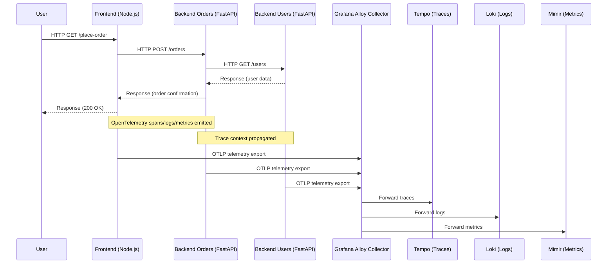
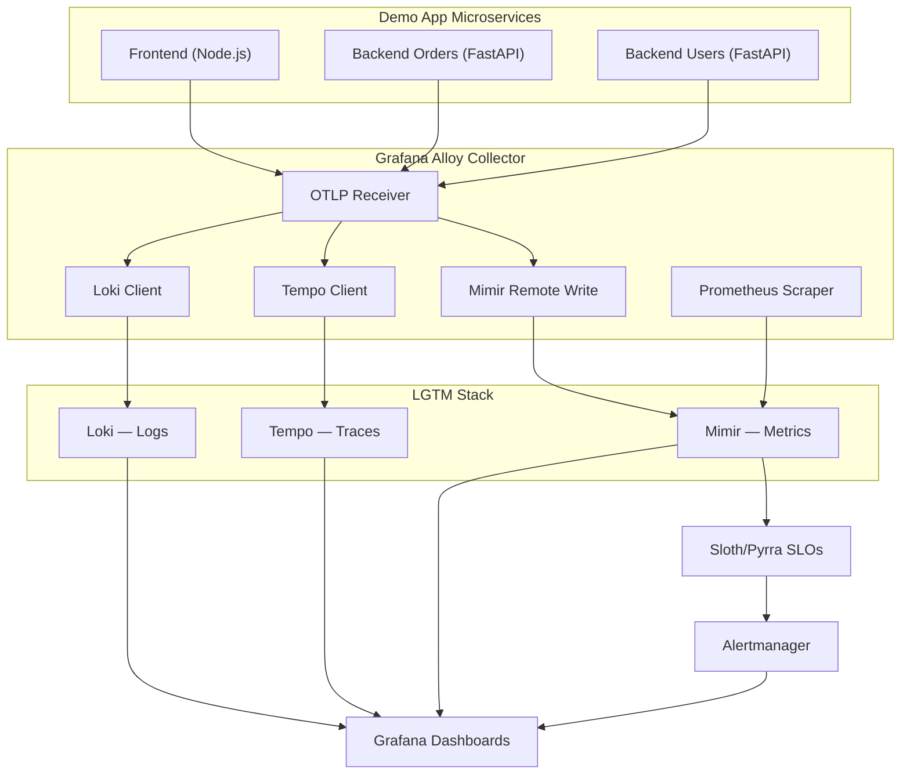

# Architecture — Observability Platform

This document illustrates the architecture of the observability stack and how telemetry flows across services.

---

## 📊 High-Level Diagram

```ascii
                ┌───────────────┐
                │   Frontend    │ (Node.js)
                └───────┬───────┘
                        │
                        ▼
                ┌───────────────┐
                │ Backend Orders│ (FastAPI)
                └───────┬───────┘
                        │
                        ▼
                ┌───────────────┐
                │ Backend Users │ (FastAPI)
                └───────┬───────┘
                        │
                        ▼
                ┌─────────────────────┐
                │ Grafana Alloy       │
                │ (Unified Collector) │
                └───────┬─────────────┘
   ┌────────────────────┼────────────────────┐
   ▼                    ▼                    ▼
┌───────┐          ┌────────┐           ┌────────┐
│ Loki  │          │ Tempo  │           │ Mimir  │
│ Logs  │          │ Traces │           │ Metrics│
└───┬───┘          └───┬────┘           └───┬────┘
    │                  │                    │
    └──────────┬───────┴──────────────┬─────┘
               ▼                      ▼
         ┌───────────┐          ┌──────────────┐
         │ Grafana   │          │ Alertmanager │
         │ Dashboards│          │ Alerts       │
         └───────────┘          └──────────────┘
```

---

## 🔄 Sequence Diagram — Request Flow



---

## 🔀 Data Flow Diagram — Telemetry Pipeline



---

## 🔑 Key Components

- **Demo App**: Node.js frontend + Python FastAPI backends emit telemetry.  
- **Grafana Alloy**: Unified collector for metrics, logs, and traces.  
- **Loki**: Centralized log storage and querying.  
- **Tempo**: Distributed tracing backend.  
- **Mimir**: Scalable metrics storage and query engine.  
- **Grafana**: Dashboards, Explore, and visualization.  
- **Alertmanager**: Alert routing and inhibition.  
- **Sloth/Pyrra**: SLO definitions and error budget tracking.  

---

## ⚖️ Resource Constraints

- PVCs downsized (Grafana, Loki, Mimir = 2Gi; Tempo = 1Gi)  
- Resource requests/limits reduced (100m CPU / 256Mi memory typical)  
- Retention policies shortened (logs 7d, traces 3d)  

---

## 🧭 Why This Matters

This architecture demonstrates:
- **GitOps orchestration** with Argo CD App‑of‑Apps.  
- **End‑to‑end observability** across metrics, logs, and traces.  
- **Realistic demo app** with service boundaries and telemetry propagation.  
- **SLO‑driven alerts** integrated into the platform.  

---
